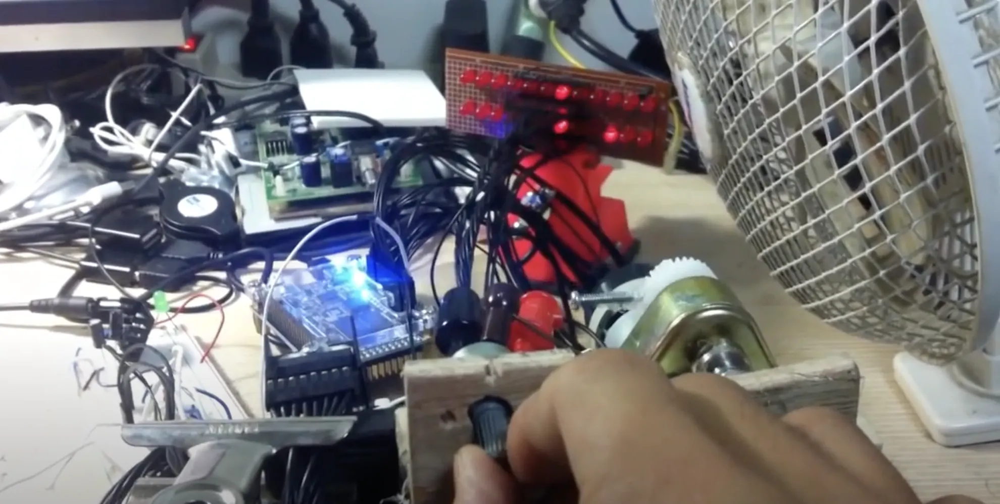

# From Zero to Robo-Hero: The Chill Journey of Motor Control with VHDL 🤖

Ever wanted to dive deep into motor control using VHDL? I got you covered. Check out my journey below!

[YouTube](https://youtu.be/-6c5I5M3VOI)

[Blog](https://about.armcortex.cc/post/pid-dc-motor-controller/)

## Project Overview
To add a little spice to my VHDL learning journey, I snagged myself an Altera DE0 Nano board. But, of course, following book examples wasn't enough for me. So, I aimed high with a dream from years ago: precise angle control for a DC motor. After all, what's a robotics dream without some motor action, right?

## Features & Implementation

### 1. Feedback System
- A DC motor paired up with a variable resistor for angle feedback.
- Another variable resistor used for sending angle command data.

### 2. Visual Feedback with LEDs
- Two rows of 12 LEDs each.
    - One row shows ADC info of the command.
    - The other displays feedback from the motor.

### 3. VHDL for SPI Protocol
- Tackled the SPI protocol of the 12-bit ADC IC on the DE0 Nano.
- Spent good quality time with the ADC's datasheet and Modelsim to get the protocol right.

### 4. PID Controller in Action
- Dynamic generation of PWM with varying duty cycles.
- Ensures the motor micro-adjusts and nails that precise angle every time.

### Closing Thoughts
This project was an electrifying blend of VHDL and the thrill of robotics. Dive in and check out the code. Let's get those motors spinning in style! 🤘

