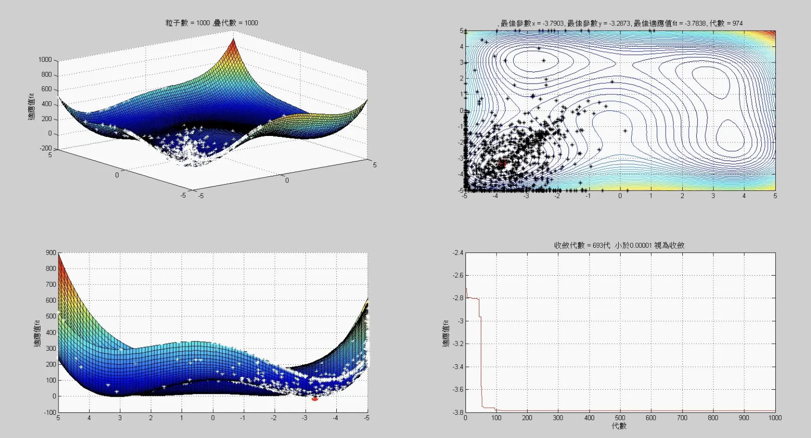

# Particle Swarm Optimization (PSO) on MATLAB

[YouTube](https://youtu.be/GZXmBI78t7U)

[Blog](https://about.armcortex.cc/post/particles-swarm-optimization-practice/)

Diving deep into the mesmerizing world of the PSO algorithm, we've created a MATLAB-based tool to explore the complex terrains of the Himmelblau Function. Let's explore!

## 🔥 Highlights
### 1. PSO Magic on MATLAB:
Harness the power of 1000 particles unleashed in the vast expanse of the Himmelblau Function, hunting for that elusive lowest point.

### 2. Inspired by Originality:
Our project didn't just spring out of thin air. We dove into the OG research papers, connecting the dots from foundational concepts to our implementation.

### 3. Experience the Algorithmic Might:
This isn't just about number-crunching. It's a journey through the mathematical landscape, feeling the raw power of the PSO algorithm.

---
For those who love to deep-dive into algorithms and appreciate the art of optimization, welcome aboard! If you have suggestions, feedback, or improvements, PRs are wholeheartedly welcome. Here's to algorithmic adventures! 🚀